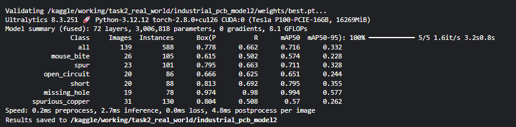

Task 2: Automated Quality Inspection System (Industrial Implementation)
=======================================================================

1\. Project Overview
--------------------

This project implements an automated visual inspection prototype designed for high-precision defect detection in manufactured electronic components. Utilizing **Printed Circuit Boards (PCBs)** as the target item, the system demonstrates advanced computer vision capabilities in identifying complex, small-scale defects within high-density circuitry environments.

2\. Dataset Strategy: Synthetic to Real-World
---------------------------------------------

The project followed a two-phase data strategy to ensure model robustness:

### Phase A: Procedural Data Generation

To overcome the "cold start" challenge of limited defective samples, a **procedural data generation engine** was developed. This engine:

*   Synthesizes unique PCB backgrounds with randomized circuitry.
    
*   Injects defect classes: **Missing Components**, **Scratches**, and **Discoloration**.
    

### Phase B: Real-World Industrial Adaptation

The model was further adapted and validated using a **Real-World Industrial Dataset** featuring 6 critical defect categories. This phase involved converting **Pascal VOC XML** annotations into a normalized **YOLO** format and managing class imbalances through strategic data shuffling.

3\. Computer Vision Solution
----------------------------

The core inspection engine utilizes a fine-tuned **YOLOv8n (Nano)** model, selected for its optimal balance of inference speed and detection accuracy in real-time manufacturing lines.

### Key Pipeline Features (run\_inference.py):

1.  **Localization:** High-precision bounding box prediction with confidence scoring.
    
2.  **Spatial Mapping:** Automatic calculation of **(x, y) pixel coordinates** for the center of every defect, facilitating robotic pick-and-place integration.
    
3.  **Automated Severity Triage:** Categorizes defects into two priority levels:
    
    *   **🔴 CRITICAL:** (e.g., Open Circuit, Short, Missing Hole)
        
    *   **🟡 MEDIUM:** (e.g., Mouse Bite, Spur, Spurious Copper)
        

4\. Performance & Validation
----------------------------

The model achieved high reliability across the industrial defect spectrum, with a **global mAP50 of 0.716** on complex real-world textures.

### Quantitative Metrics:

| Defect Type | Precision | Recall | mAP50 | Severity |
| :--- | :---: | :---: | :---: | :--- |
| **Missing Hole** | 0.974 | 0.980 | 0.994 | 🔴 CRITICAL |
| **Short** | 0.813 | 0.692 | 0.795 | 🔴 CRITICAL |
| **Open Circuit** | 0.666 | 0.625 | 0.651 | 🔴 CRITICAL |
| **Mouse Bite** | 0.615 | 0.502 | 0.574 | 🟡 MEDIUM |

### Qualitative Validation (Visual Proof)

Below is the **Industrial Defect Gallery** showing the model successfully identifying and labeling diverse real-world defects:

5\. Repository Structure
------------------------

*   **best.pt**: Fine-tuned YOLOv8n model weights.
    
*   **run\_inference.py**: Main pipeline for automated inspection and severity reporting.
    
*   **data\_converter.py**: Robust script for Pascal VOC XML to YOLO TXT conversion.
    
*   **pcb\_real.yaml**: Dataset configuration mapping for 6 industrial classes.
    
*   **per\_class\_metrics.csv**: Detailed statistical performance breakdown.
